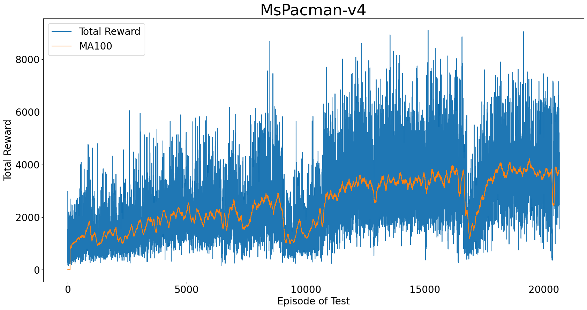

# pytorch a3c-lstm

This is my study note of an implementation of Asynchronous Advantage Actor Critic (A3C) by coding with PyTorch.

## Demo (Using a3c-lstm to solve atari games)


## Requirements

- PyTorch
- OpenAI Gym and Universe
- Numpy

```
conda install -y -c pytorch --file 'requirements/requirements_pytorch.txt'
conda install -y -c conda-forge --file 'requirements/requirements_gym.txt'
```

## Usage

### Training

for 32 workers dispatched to 4 GPU

```
python main.py --MsPacman-v4 --workers 32 --gpu-ids 0 1 2 3
```

for 4 workers dispatched to 1 GPU

```
python main.py --MsPacman-v4 --workers 4 --gpu-ids 0
```

for 4 workers dispatched to CPU

```
python main.py --MsPacman-v4 --workers 4 --gpu-ids -1
```

### Evaluation

```
python gym_eval.py
```

## Results


## References

- Paper:
1. [Asynchronous Methods for Deep Reinforcement Learning](https://arxiv.org/pdf/1602.01783v1.pdf)


- Github:
1. https://github.com/dgriff777/rl_a3c_pytorch
2. https://github.com/ikostrikov/pytorch-a3c